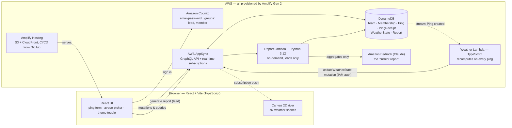
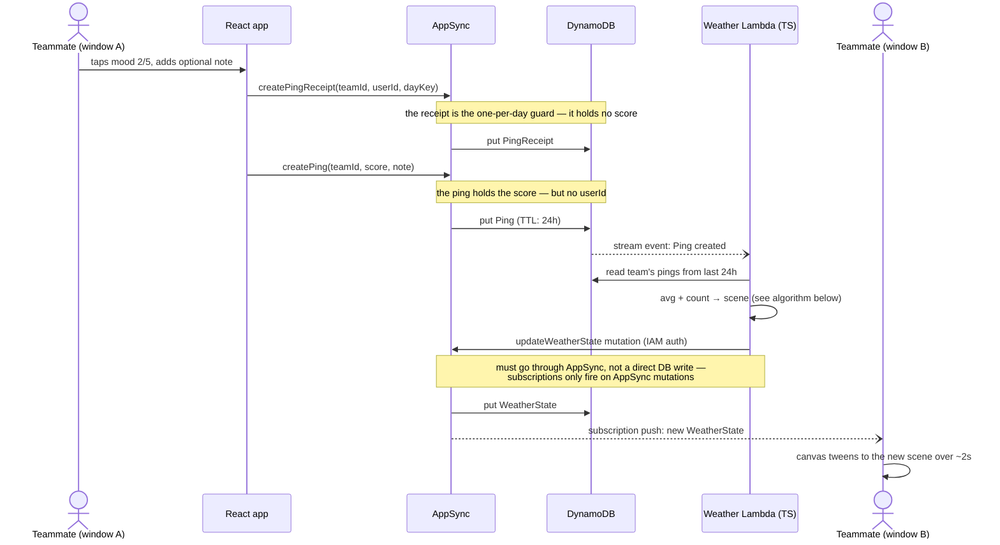
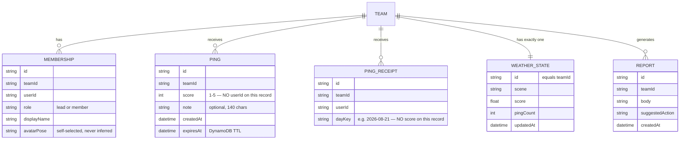
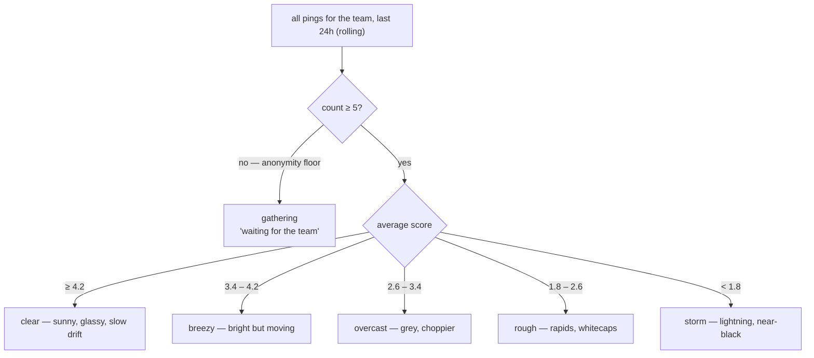

# Undercurrent — Architecture

How the system fits together, and *why* it's shaped this way. Diagrams are Mermaid —
GitHub renders them inline.

## System overview

Dashed arrows are the real-time path — the part that makes the demo land.

## The life of a ping

The core loop of the whole app. Window A pings; window B's river changes.

**The gotcha worth knowing:** AppSync subscriptions fire when a *mutation goes through
AppSync* — not when a row changes in DynamoDB. If the weather Lambda wrote straight to
the table with `PutItem`, every client would silently see a stale river. This is the
riskiest wire in the system and the reason real-time gets proven on night one.

## Data model — anonymity is structural

The most important design decision in the app: **`Ping` has a score but no author;
`PingReceipt` has an author but no score.** One-ping-per-day is enforced on the
receipt. A UI can promise anonymity and be wrong later — a schema physically cannot
leak what it never stored. General pattern: *enforce invariants in the data model,
not the interface.*

Two smaller notes:

- `expiresAt` uses DynamoDB TTL so old pings clean themselves up — but TTL deletion is
  lazy (can lag by hours), so the weather Lambda still filters by `createdAt`. TTL is
  cleanup, not correctness.
- `WeatherState.id` *is* the teamId — a one-row-per-team materialized view. Clients
  subscribe to exactly one tiny row instead of streaming pings.

## Weather algorithm

Server-side only. Clients never compute weather locally — one source of truth, and the
anonymity floor is enforced where users can't bypass it.

Scene transitions tween over ~2 seconds on the canvas — never snap. A single severity
scalar (0–1) derived from the scene drives water speed, palette shift, *and* avatar
bobbing amplitude, which makes the whole scene feel connected for almost no code.
Under `prefers-reduced-motion`, scenes render statically and crossfade.

## Where each language lives

| Location | Language | Why |
|---|---|---|
| `src/` — React app, canvas river | TypeScript | Frontend stack |
| `amplify/` — backend definitions (auth, data, wiring) | TypeScript | Amplify Gen 2 defines infrastructure in TS; this is not optional |
| `amplify/functions/compute-weather/` — weather aggregation | TypeScript | Hot path; uses Amplify's IAM-authed data client so the AppSync mutation (and therefore the subscription) actually fires |
| `amplify/functions/report-py/` — Bedrock report | Python 3.12 | Off the critical path, boto3-only (no packaging), invoked on demand by leads. Deliberate learning slice. |

## Why it's built this way — the five load-bearing decisions

1. **Buy the real-time layer, don't build it.** The demo *is* "ping in window A, river
   changes in window B." Hand-rolling WebSocket fan-out is weeks; AppSync gives it as a
   schema feature, and Amplify Gen 2 provisions everything from TypeScript with CI/CD
   on git push. Spend hours on what's differentiated (the river), buy the rest.
2. **Anonymity is structural, not promised** (see data model above).
3. **Weather is a materialized view.** Pings are the write model; `WeatherState` is a
   precomputed read model, one row per team, recomputed by a Lambda on each ping.
   Consistency (every window shows the same river), enforcement (the 5-ping floor
   lives server-side), efficiency (subscribers get one tiny row).
4. **The Lambda mutates through AppSync, never straight to DynamoDB** — otherwise no
   subscription fires (see the gotcha above).
5. **One shared severity scalar animates everything** — water, sky, avatar bobbing —
   so six scenes stay cheap and coherent.

## Privacy boundary for GenAI

The Python report Lambda sends Bedrock **aggregates only**: date range, ping counts,
daily averages, and note text that has been deduped and order-shuffled. Never
individual scores, never a note tied to a person — the Lambda physically can't,
because pings carry no author. Two extra floors on top of the structural anonymity:
no report is generated at all below 5 pings (mirroring the weather floor), and days
with fewer than 3 pings report their count but withhold the average — a one-ping
day's "average" is one person's exact answer with a date on it. Same principle as
the schema: the boundary is structural, enforced where the data leaves the system.