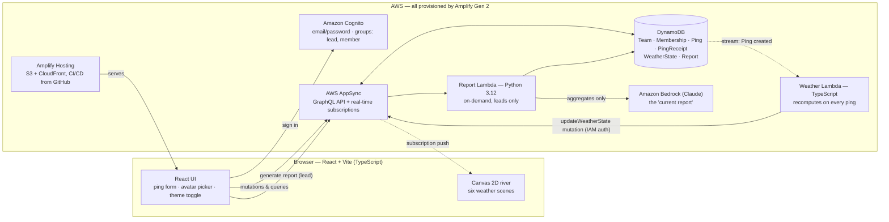

# Full Stack Challenge: Undercurrent

Undercurrent is a team-morale app for remote and hybrid teams. I built it solo in about 24 hours, with Claude Code as a pair, for the AWS Builder Center Full Stack Challenge (word prompt: CURRENT). Teammates submit one anonymous mood ping a day. The pings aggregate into a living river whose weather reflects the team's collective state, and everyone watches it change in real time. The one-line thesis: Undercurrent shortens the distance between when a team starts struggling and when its lead finds out. It prompts a conversation; it does not replace one.

Live app: https://main.d3unb3p2wvfry3.amplifyapp.com
Repo: https://github.com/SergioB03/Undercurrent

## What it does

You tap a mood from 1 to 5, optionally add a 140-character note, and press ping. With five or more pings in the rolling 24-hour window, the river shows one of six scenes: gathering, clear, breezy, overcast, rough, or storm. Below five it stays at "gathering"; the average never leaves the server.

The river is Canvas 2D, drawn live, with no art assets. Scene changes tween over two seconds; under `prefers-reduced-motion` it renders still frames with a crossfade.

Each member has an avatar with a pose they choose (floating, on a raft, underwater, struck, coconut mode, waving) and a spot on the river (drifting, the headwater, the rapids, on the big rock, in the shade, the shallows, the eddy). The weather is what the system infers; the avatar is what the person chooses to say.

Leads also get a team tab (roster and participation count, never who pinged) and a report tab: one button produces a 3–4 sentence read of the week plus one suggested action, written by Claude Haiku 4.5 on Amazon Bedrock from aggregates only. Everything syncs to every open window over AppSync subscriptions.

Because most visitors will be community members rather than a real team, a new sign-up lands in **simulation mode**: six made-up teammates have already pinged, you are the seventh, and your stone shifts the weather. Simulated pings stay in that browser and never reach the live team. The simulated team is shared by every window of one browser while the *seat* you occupy is per window, so you can open three windows, drive three different teammates, and watch the interface behave the way it would with a real team in it. A header toggle switches to the live river, and a "preview build" pill always says which mode you are in.

## Architecture

Amplify Gen 2 provisions everything from TypeScript: Cognito (email/password, with `lead`, `member`, and a `dev` group for the test environment), AppSync over DynamoDB, two Lambdas, Bedrock, and Amplify Hosting with CI/CD from GitHub. Five decisions carry the design.

**Anonymity is structural, not promised.** `Ping` has a score but no author. `PingReceipt` has an author and a day key but no score. One-ping-per-day is enforced on the receipt: its id is `userId#dayKey`, and a conditional write makes DynamoDB itself reject the second receipt of the day. A UI can promise anonymity and be wrong later. A schema cannot leak what it never stored.

**Weather is a materialized view.** Clients never compute weather locally. A TypeScript Lambda on the Ping table's stream recomputes one `WeatherState` row per team and enforces the five-ping floor where nobody can bypass it. Subscribers get one tiny row, not a stream of pings.

**The Lambda mutates through AppSync, never straight to DynamoDB.** Subscriptions fire on mutations that go through AppSync, not on table changes. If the weather Lambda wrote with `PutItem`, every client would silently watch a stale river. It is the riskiest wire in the system, so I proved it on night one.

**Buy the real-time layer.** Hand-rolling WebSocket fan-out is weeks; AppSync gives it as a schema feature.

**One shared severity scalar** drives waves, water speed, clouds, rain, lightning, bank color, and avatar bobbing, so six scenes stay cheap and coherent.

The report path is the deliberate exception. The button creates a `ReportRequest` row; that table's stream triggers a Python 3.12 Lambda that aggregates counts, daily averages, and deduped, shuffled notes, calls Bedrock's Converse API, and writes the Report straight to DynamoDB. The lead's browser polls for it; hand-signing AppSync calls from Python was not worth it for a lead-only, once-a-week surface. Haiku 4.5 was availability, not cost: the Opus and Sonnet tiers are sales-gated on a brand-new AWS account.

## How I built it

Deploy first. The first CI build failed: `npm ci` rejected a lockfile npm had just written, a known npm bug that omits bundled dependencies' subtrees. Regenerating the lockfile did not help; an `amplify.yml` switching the build to `npm install` did, and build #2 went green.

Real-time was proven the same night as a script, not an eyeball test: `scripts/prove-realtime.ts` signs in, subscribes to `WeatherState`, submits a ping, and fails loudly if nothing arrives within 30 seconds.

Bedrock ambushed me anyway. Every invoke returned AccessDenied: not model access, but new-account verification. A 10-second CLI test found it before the Lambda existed, so the feature got built while AWS finished verifying. Then a second gate: Anthropic models need a one-time use-case form, which the console hides well and the CLI does not (`aws bedrock put-use-case-for-model-access`). Fifteen minutes after submitting it, the Python Lambda wrote its first real report.

Before submission I ran a multi-agent adversarial review: 32 agents, 28 findings, 23 confirmed and fixed the same night. Amplify v6's `signIn` resolves rather than throws for unconfirmed accounts: a dead screen for any judge who abandoned the confirmation code. Nothing stopped a crafted score of 9999 from pinning the weather at "clear". A second pass (18 agents, 9 confirmed) caught that the 30fps throttle was really running near 20fps.

A third pass, driving the app through visitor use cases, found the two best bugs of the build. Simulation mode crashed the whole page to white: the new code read a `const` declared twenty lines further down, and because the mode preference is remembered *and* simulation is the default for new sign-ups, a visitor would have met a blank page on every load from then on. TypeScript catches that instantly; the dev server strips types without checking them, which is exactly why two Playwright runs I had written off as flaky were the tests being right and me being wrong. The other was quieter. A window with no saved seat read `Number(sessionStorage.getItem("uc-sim-seat"))` and range-checked the result — but `Number(null)` is `0`, a perfectly valid seat, so every first window sat down in the first teammate's chair and inherited their ping. The visitor's opening view was "you pinged 1 — the river went rough" before they had touched anything, which quietly destroys the one premise the sandbox has. Absent has to mean absent, not zero.

The river went through four drafts. A flat horizon read as "ocean", not "place". A stream running toward the viewer was better. A corner-to-corner three-quarter view, built as a sampled path of 80 points, gave reeds, rocks, and named spots a tangent and normal to hang off. The final form turned that path back toward the viewer, a change to the path generator rather than a rewrite. Offset curves taught one lesson twice: a bank folds into a fin when the half-width exceeds the centerline's bend radius, and fading the meander out just moved the fold upstream into a hook. The fix: a gentle meander confined to the narrow upper 65%, with a sin² envelope.

An external design pass used `--silt` as dark text, but in the light theme `--silt` is the pale page ground, so every inherited heading vanished. Tokens are roles, not colors: `--silt` is the ground and `--foam` is the text.

The first real tester was me, with a real email on the public URL. Three bugs, three root causes. Poses landing on the wrong character was a shared browser session: Amplify keeps one signed-in user per browser, so signing in on a second tab silently swapped the first tab's tokens. A laggy page was phone DPR: at devicePixelRatio 3 the river was a roughly 3500px-wide backing store redrawn 60 times a second; now capped at 1.5, 30fps, paused when hidden. No dev access was just group membership.

## What I learned

- Deploy on hour one. The lockfile bug cost minutes on night one, not the submission.
- Prove the riskiest wire with a script that can fail, then run it against production.
- Enforce invariants in the data model, not the interface.
- Check an external service with a 10-second CLI call before building on it.
- Test the way strangers will. Headless private windows never saw the shared-session bug; a real sign-up on a phone did.

## What's next

The receipt-to-ping pair is orchestrated by the client, so a hand-crafted API call can create a ping without a receipt, and a hostile account could pre-create another user's receipt id. Real enforcement is a custom mutation doing both writes server-side, first on the list. After it: multi-team support, the EventBridge weekly scheduled report, and weather decay as pings age.

Undercurrent does not tell a lead what is wrong. It shortens the time until they ask.
